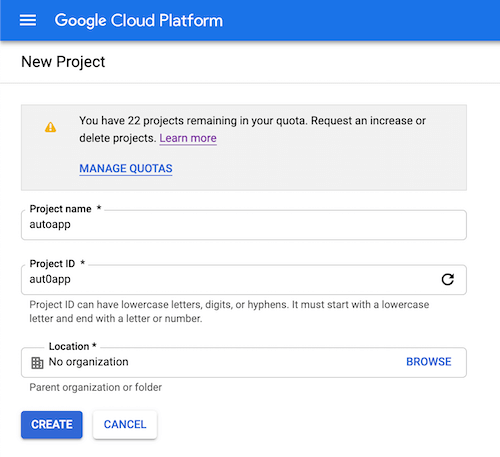
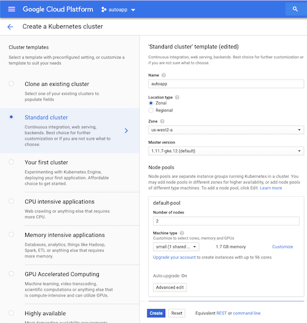
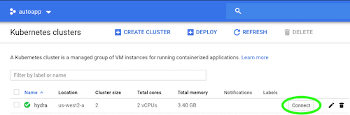

# Prerequisites

## Google Cloud Platform

This tutorial leverages the [Google Cloud Platform](https://cloud.google.com/) to streamline provisioning of the compute infrastructure required to bootstrap a Kubernetes cluster from the ground up. [Sign up](https://cloud.google.com/free/) for \$300 in free credits.

[Estimated cost](https://cloud.google.com/products/calculator/#id=a0e9772e-d50b-40e4-9f7a-13f6916b5321) to run this tutorial: $0.022 per hour ($1.03 per day).

> The compute resources required for this tutorial exceed the Google Cloud Platform free tier.

### Create a new cluster

##### Create a project with a desired project-id

> Make sure billing is setup for the project



##### Create a 2 node cluster

> I chose us-west2 just because I always choose California regions (closest to me)



## Google Cloud Platform SDK

### Install the Google Cloud SDK

Follow the Google Cloud SDK [documentation](https://cloud.google.com/sdk/) to install and configure the `gcloud` command line utility.

Verify the Google Cloud SDK version is 240.0.0 or higher:

```
gcloud version
```

### Set a Default Compute Region and Zone

This tutorial assumes a default compute region and zone have been configured.

If you are using the `gcloud` command-line tool for the first time `init` is the easiest way to do this:

```
gcloud init
```

Otherwise set a default compute region:

```
gcloud config set compute/region us-west2
```

Set a default compute zone:

```
gcloud config set compute/zone us-west2-a
```

## Install Kubectl

Easist way if you're on an 🍎 💻 is with [homebrew](https://brew.sh/):

```bash
$ brew install kubernetes-cli

# Test to ensure the version you installed is sufficiently up-to-date
$ kubectl version
```

Otherwise refer to [this](https://kubernetes.io/docs/tasks/tools/install-kubectl/)!

## Connect to your cluster

After the `gcloud` cli is successfully installed and setup on your machine let's connect to it, by clicking `connect`



Next copy 🍝 into your terminal

```bash
$ gcloud container clusters get-credentials autoapp --zone us-west2-a --project autoapping

$ kubectl get nodes

NAME                                    STATUS    ROLES     AGE       VERSION
gke-autoapp-default-pool-abcx123-abcd   Ready     <none>    41m       v1.11.7-gke.12
gke-autoapp-default-pool-abcx123-efgh   Ready     <none>    41m       v1.11.7-gke.12
```

Next: [Installing the Client Tools](02-client-tools.md)
