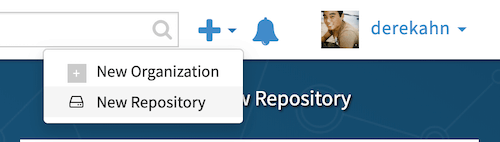
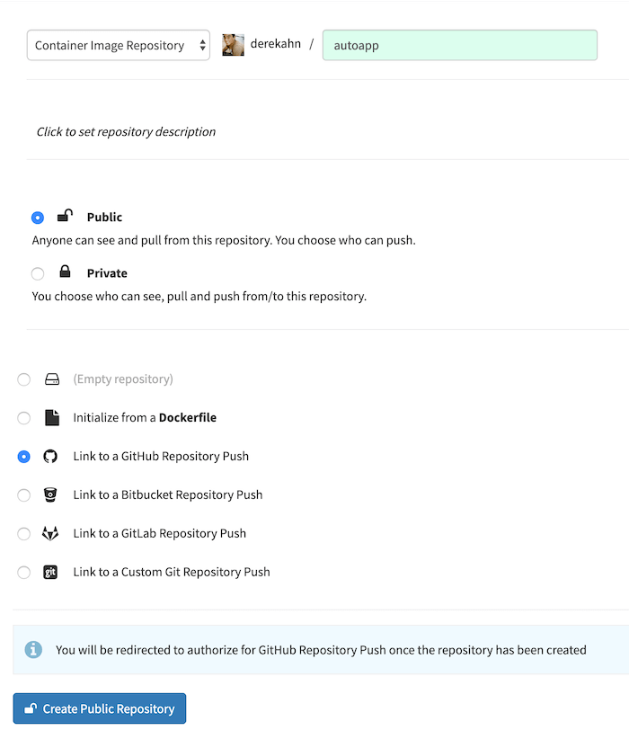
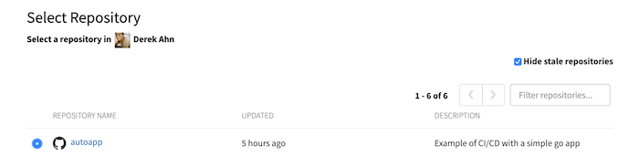
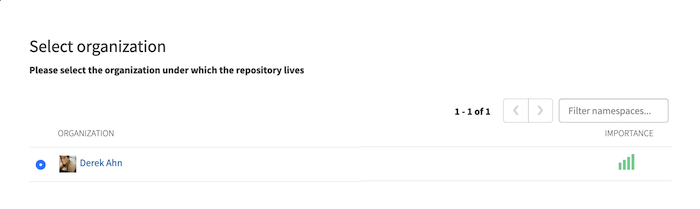
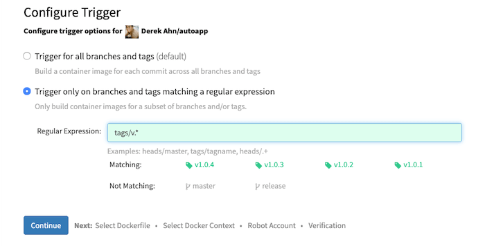
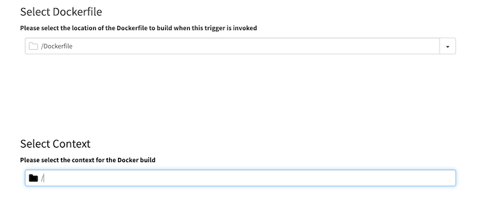

# Setting Up Quay

We are going to configure quay to pull and trigger a build on any pull requests on any branch with a `v.*` tag; ie `v1.0.1`.

### 1. Select the `+` icon at the top right

> Select `New Repository`

### 2. Set it up this repo to be `public`

> Public repos are free

### 3. Select autoapp

> This is assuming you signed up with Github

### 4. Select yourself

### 5. Setting up the build triggers

> This indicates to quay to pull and build on any push to github's `origin` with a new tag

### 6. Configs regarding docker builds and Dockerfile

> Nothing special here (defaults)

#### Nice 👍! [Quay](https://quay.io) is now wired up to our remote [repo](https://github/derekahn/autoapp) and will run on any push to remote or PR with a new tag.

## Sections

| Previous                                             | Next                                          |
| ---------------------------------------------------- | --------------------------------------------- |
| [Deploying Spinnaker to k8s](03-deploy-spinnaker.md) | [Setting Up Spinnaker](05-setup-spinnaker.md) |
