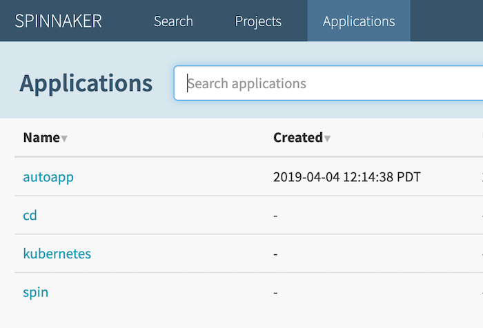
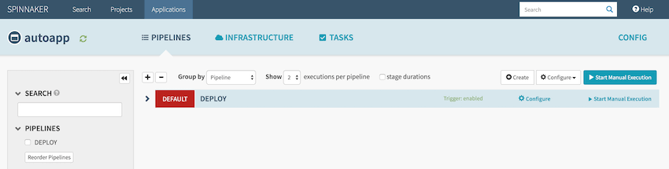

# Setting Up Spinnaker

In this section we'll be configuring our [Spinnaker](http://localhost:8080) so that it will trigger a deployment strategy of `canary -> production`

## Create a GCP Cloud Storage bucket for k8s manifests

[Spinnaker](https://spinnaker.io) needs access to your Kubernetes manifests in order to deploy them to your clusters. After your manifests are in [Cloud Storage](https://cloud.google.com/storage/), [Spinnaker](https://spinnaker.io) can download and apply them during your pipeline's execution.

```bash
$ export PROJECT=$(gcloud info --format='value(config.project)')

# Create bucket in GCP cloud storage (equivelant to AWS s3)
$ gsutil mb -l us-west2 gs://$PROJECT-kubernetes-manifests

  Creating gs://PROJECT/...
```

## Upload manifests to GCP Cloud Storage Bucket

> This can be automated with a CI or Spinnaker itself, but for quick and dirty we'll do it manually since we just created the bucket

```bash
$ export PROJECT=$(gcloud info --format='value(config.project)')

# Check the env is set correctly to your unique GCP project-id
$ env | grep "PROJECT"

  PROJECT=autoapping

# Assuming your $PWD is in the root of project upload manifests
$ {
  gsutil cp -r deployments/autoapp/deployment gs://$PROJECT-kubernetes-manifests
  gsutil cp -r deployments/autoapp/service exp gs://$PROJECT-kubernetes-manifests
}

# Double check the uploads
$ gsutil ls gs://$PROJECT-kubernetes-manifests

  gs://autoapping-kubernetes-manifests/deployment/
  gs://autoapping-kubernetes-manifests/service/
```

## Create an Application in Spinnaker

> It's possible to do everything below with the dashboard in our deployed [Spinnaker](http://localhost:8080/), but we'll be using the [Spin CLI](01-client-tools.md) because it's faster and easier to follow along because you can copy 🍝

Utilizing the [Spin CLI](01-client-tools.md) we installed in a previous section we're going to create an application

```bash
# Create a Spinnaker "Application"
$ spin application save --application-name autoapp \
                        --owner-email $QUAY_EMAIL \
                        --cloud-providers kubernetes \
                        --gate-endpoint http://localhost:8080/gate
```

#### It should look like this in your [Spinnaker Dashboard](http://localhost:8080/#/applications)



## Upload a new pipeline to our Spinnaker App

```bash
# Double check env variables
$ env | grep  'QUAY\|PROJECT'

  PROJECT=autoapping
  QUAY_USER=derekahn

# Interpolate with env variables and create a pipeline.json
$ sed -e s/\$PROJECT/$PROJECT/g \
      -e s/\$QUAY_USER/$QUAY_USER/g \
      deployments/autoapp/pipeline-template.json >> deployments/autoapp/pipeline.json

# Create the pipeline
$ spin pipeline save \
  --gate-endpoint http://localhost:8080/gate \
  -f deployments/autoap/pipeline.json

  Could not read configuration file from /Users/$USER/.spin/config.
  Pipeline save succeeded
```

#### It should look like this in your [Spinnaker Dashboard](http://localhost:8080/#/applications/autoapp/executions)




#### Woohoo 🎉! Our Spinnaker is now wired up to our `quay.io/$QUAY_USER/autoapp` repository and will trigger a deployment on any new tags such as `v1.0.0`

## Sections

| Previous                            | Next |
| ----------------------------------- | ---- |
| [Setting up Quay](04-setup-quay.md) |      |
