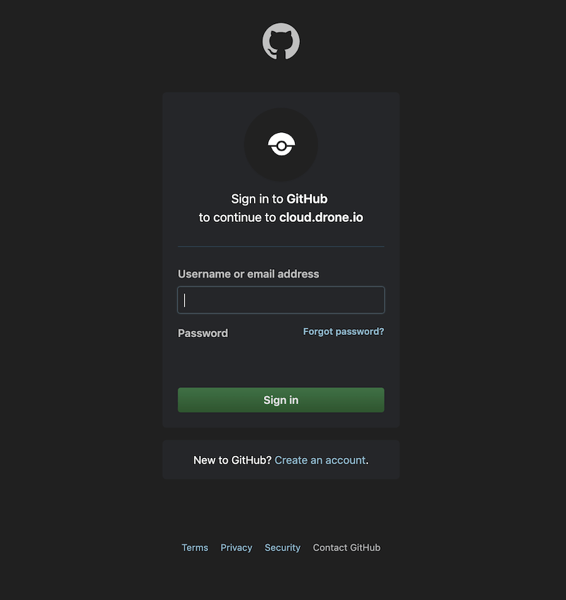
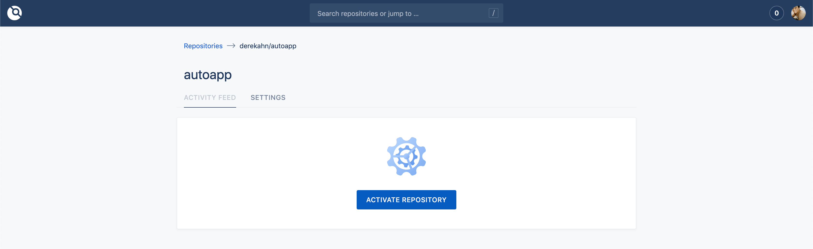
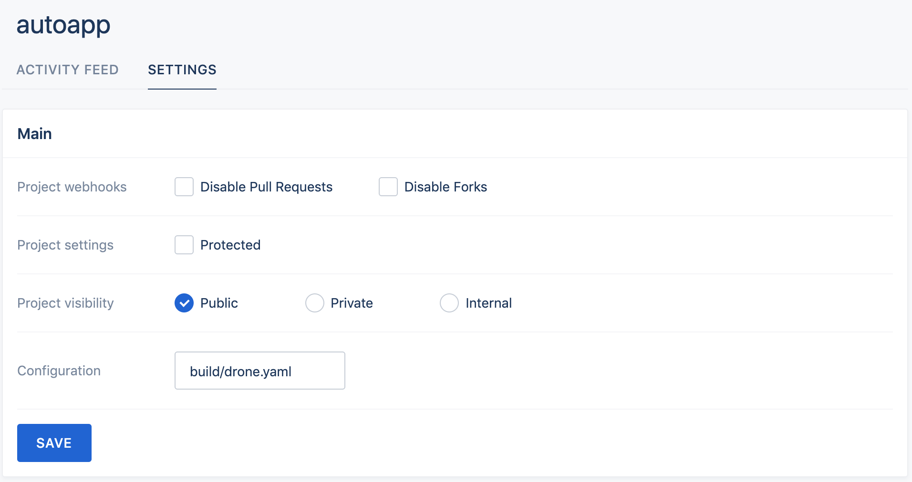

# Setting Up Continuous Integration

In this section we'll be finishing the CI flow, I say `finishing` because we've already configured [Quay](https://quay.io) to pull, build, and secruity scan on any new tag on our [remote repo](https://github.com/derekahn/autoapp/pulls) so that's half of it. This will be the first half in which runs our `Go` tests and tests the 🐳 build on a pre-merge hook

So there's some redundancy happening but I think is important and good if your mantra is `DON'T BREAK THE BUILD!`

Because we're utilizing [github](https://github.com)/[gitlab](https://gitlab.com) and this is a public repo ([OSS](https://en.wikipedia.org/wiki/Open-source_software)) we can utilize drone's free services.

## Goto [drone.io](https://drone.io)

> Click `Login`


## Authorize via github oauth



## Select repo

> Select `autoapp` repo



## Configure triggers

> Because we're adhering to [golang-standards](https://github.com/golang-standards/project-layout) our project layout has our build files in `build/` dir



## Drone yaml explained

The drone config in `build/` is already setup but we can explain what's happening

```yaml
---
pipeline: # <- drone syntax
  test: # test phase runs a go docker image and leverages our make cmds
    image: golang
    commands:
      - make test
      - make coverage

  build: # build phase tests our docker build
    image: plugins/docker
    repo: derekahn/autoapp # required for this "plugin"
    dry_run: true # indicates to just check build and not push to a registry
```

#### All set 🙌! CI is totally configured as a 2 step process:

1.  First step [Drone](https://drone.io) will be configured as a pre-merge hook which will check tests and build (bit redundant, but thorough).
2.  Second step will be on post merge which we've already configured [Quay](https://quay.io) to trigger a pull on any new recieved tags (ie `v1.0.0`) to our remote repo, in which [Quay](https://quay.io) will then pull and rebuild a fresh image.

## Sections

| Previous                                      | Next                         |
| --------------------------------------------- | ---------------------------- |
| [Setting Up Spinnaker](05-setup-spinnaker.md) | [Deploying 🚀](07-deploy.md) |
