# Deploying 🚀

This is the final section of our `how to CI/CD`. In this section we will:

0. Branch from `master` and create a `bug-fix` branch, change something (color, html, etc)
1. Commit changes and then push said branch to the remote repo
2. Submit a `pull-request`, and upon a successful code review with successful CI checks, we accept the `pull-request`
3. Pull latest from `master` update tagging and push to remote repo then watch the magic ✨ happen!

## #0 branch off master

#### Branch off master

```bash
$ git branch

  * master
  (END)

$ git checkout -b fix-welcome-copy

$ git branch

  * fix-welcome-copy
    master
  (END)
```

#### Making a change

> Open `welcom.html`

```bash
$ vim web/template/welcome.html
```

> Change some copy; ie. `"Welcome"` -> `"Aloha"`

```html
10    <div class="welcome center">Aloha {{.Name}}, it is {{.Time}}</div>
```

> Save and quit vim

```vim
:wq!
```

## #1 commit changes and push to remote repo

```bash
# Check changes
$ git status

  On branch fix-welcome-copy
  Changes not staged for commit:
    (use "git add <file>..." to update what will be committed)
    (use "git checkout -- <file>..." to discard changes in working directory)

    modified: web/template/welcome.html

# Stage changes
$ git add web/template/welcome.html

# Commit changes with a descriptive message
$ git commit -m "Fixed the welcome.html copy to be more hawaiian"

  [deploy xxxxxxx] Fixed the welcome.html copy to be more hawaiian

# Push to remote origin
$ git push -u origin fix-welcome-copy

  Enumerating objects: 11, done.
  Counting objects: 100% (11/11), done.
  Delta compression using up to 8 threads
  Compressing objects: 100% (7/7), done.
  Writing objects: 100% (7/7), 1.73 KiB | 1.73 MiB/s, done.
  Total 7 (delta 4), reused 0 (delta 0)
  remote: Resolving deltas: 100% (4/4), completed with 3 local objects.
  remote:
  remote: Create a pull request for 'fix-welcome-copy' on GitHub by visiting:
  remote:      https://github.com/$USER/autoapp/pull/new/fix-welcome-copy
  remote:
  To github.com:$USER/autoapp.git
   * [new branch]      fix-welcome-copy -> fix-welcome-copy
```

## #2 Submit a pull-request and merge

> Create a new `pull-request`

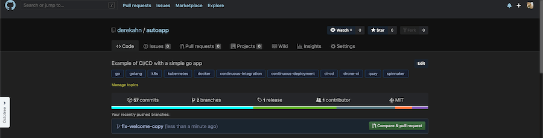

> Write a descriptive summary/report of changes

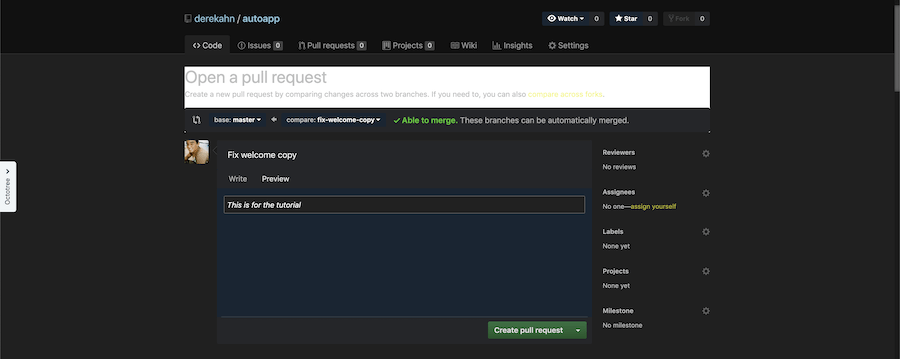

> CI (drone) checks are successful

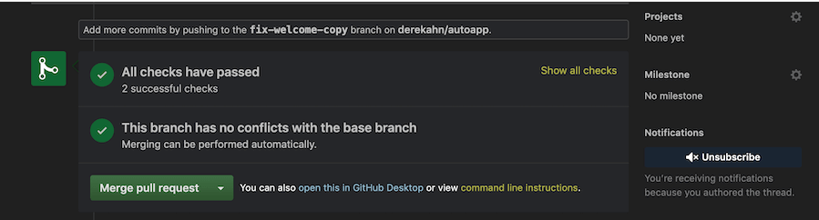

## #3 Update master and push new tags

```bash
# Switch branches back to master
$ git checkout master

# Check that we're on master
$ git branch

  * master
  (END)

# Pull recently merged PR
$ git pull

  remote: Enumerating objects: 1, done.
  remote: Counting objects: 100% (1/1), done.
  remote: Total 1 (delta 0), reused 0 (delta 0), pack-reused 0
  Unpacking objects: 100% (1/1), done.
  From github.com:$USER/autoapp
     e7535e9..b0a2d41  master     -> origin/master
  Updating e7535e9..b0a2d41
  Fast-forward
    web/template/welcome.html          |   1 +

# Create a new tag
$ git tag 0.1.0

# push tags
$ gp --tags

  Total 0 (delta 0), reused 0 (delta 0)
  To github.com:$USER/autoapp.git
   * [new tag]         v0.1.0 -> v0.1.0
```

## Now sit back relax and watch the magic ✨

#### [Quay](https://quay.io)

You can check to see the hook fired (replace $USER with yours): https://quay.io/repository/$USER/autoapp?tab=tags

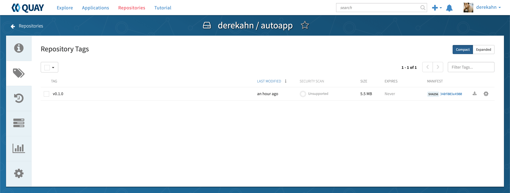

#### [Spinnaker](https://localhost:8080)

```bash
# Double check that spinnaker is exposed
$ env | grep "DECK_POD"

  DECK_POD=spin-deck-67d875cd75-zpd4l

# IF NOT set env DECK_POD again
$ export DECK_POD=$(kubectl get pods --namespace default \
    -l "cluster=spin-deck" \
    -o jsonpath="{.items[0].metadata.name}")

# re-expose port and run in background process in this session
$ kubectl port-forward --namespace default $DECK_POD 8080:9000 >> /dev/null &
```

[Check pipline](http://localhost:8080/#/applications/autoapp/executions)

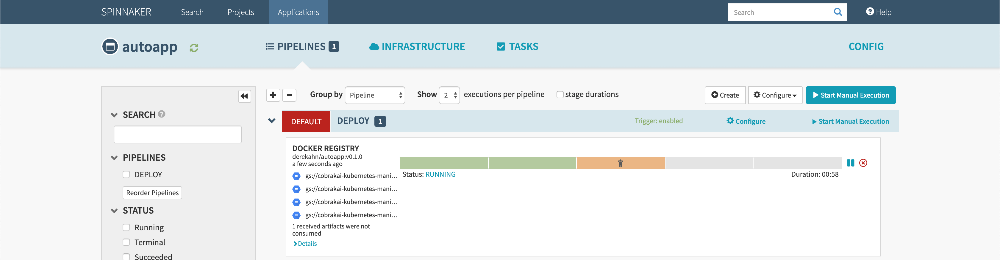

[Check Load Balancers](http://localhost:8080/#/applications/autoapp/loadBalancers)

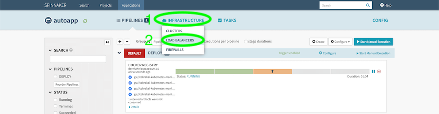

[Check canary](http://localhost:8080/#/applications/autoapp/loadBalancers/loadBalancerDetails/kubernetes/default/default/service%20autoapp-canary)

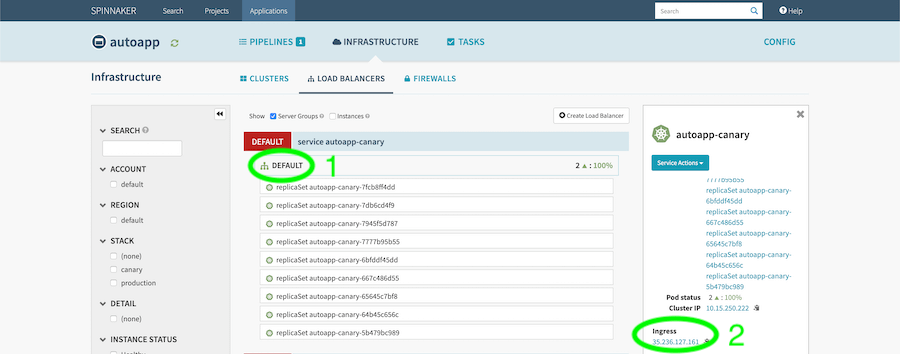

[Go back to pipline](http://localhost:8080/#/applications/autoapp/executions)

> Click continue

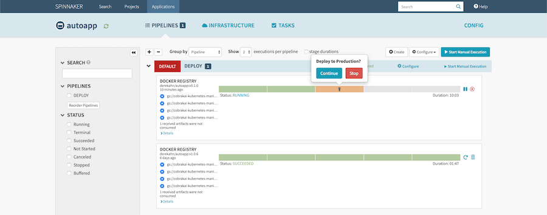

> 👀 Watch it run 🏃

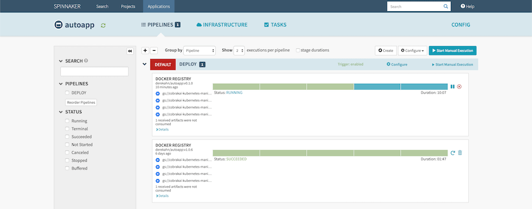

> Watch it complete 🏁

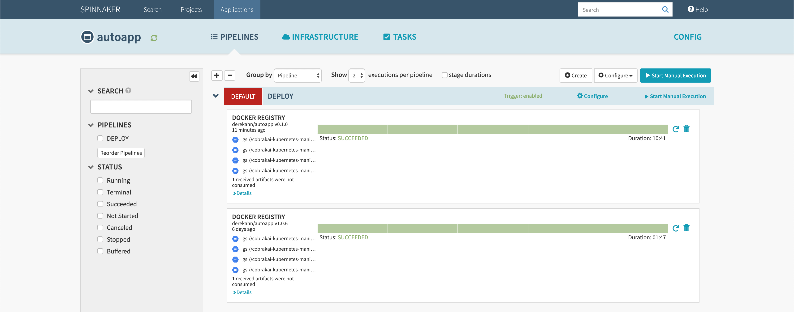

[Go back to Load Balancers](http://localhost:8080/#/applications/autoapp/loadBalancers)

> Check the recently deployed production

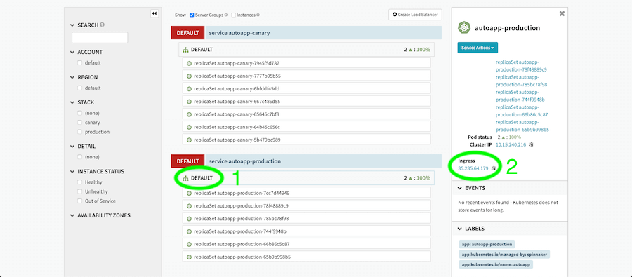

### 🥳Au Pau🏁  Congratulations if you made it this far and it worked 👏. Please feel free to submit `pull-requests` forany improvements 🍻.

## Sections

| Previous                              |
| ------------------------------------- |
| [Setting up Drone](06-setup-drone.md) |
